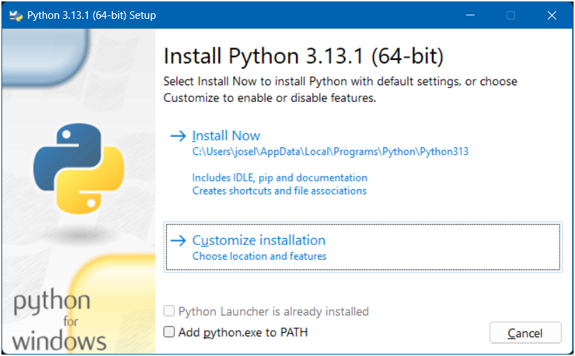
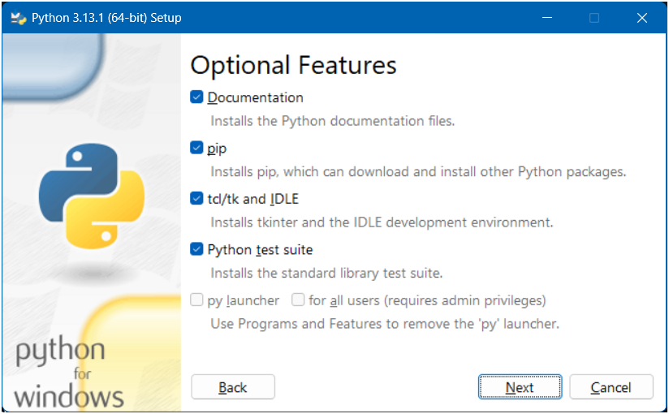
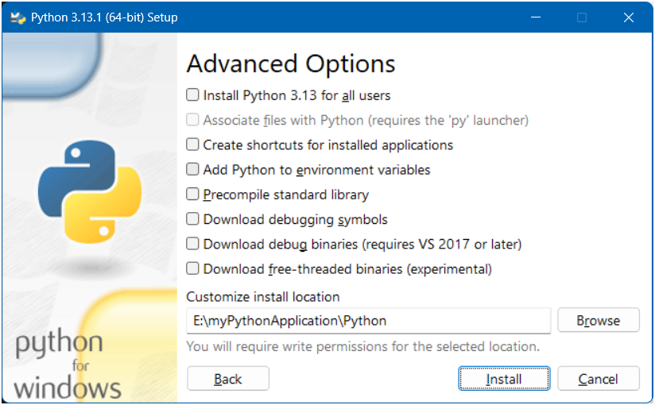
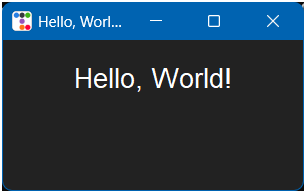

# How to create a portable Python installation on Windows

The goal is to get the Python installation into a folder that can be distributed along with your scripts to ensure that you can package it all together and get it working on another computer without having to pre-install Python or any modules or packages.

Python itself is distributed under the Python Software Foundation License (PSFL). This is a permissive open-source license, meaning it allows you to:
- Use Python for any purpose: including commercial use.
- Modify the Python source code: and distribute your modified versions.
- Distribute Python: in both source code and binary forms.

If you are going to add additional third-party packages or modules, please check their licenses before distributing.

## Requirements

- A computer with Windows
- Internet access (to download Python and other packages).
- Your fancy Python script.

## Steps

1. [Create folder structure](#folders).
2. [Install Python](#python).
3. [Install additional packages](#pip).
4. [Create a Python script](#script).
5. [Test and go live](#test).

## <a name="folders"></a>1. Create folder structure.

This is the folder structure I suggest:

> 📁 myPythomApplication  
> ├── 📁 Python  
> └── 📁 Scripts

## <a name="python"></a>2. Install Python.

>[!WARNING]
>ONLY download Python from https://www.python.org/. This way you will avoid possible trojans, viruses, malwares, spam and other modern evils.

In the _Downloads / Windows_ section of [Python.org](https://www.python.org/) you will find a link to '_Latest Python Release_'. Use this if you have no preference or requirement for your developments.

At the bottom of the page you will find the different versions:
- Windows installer (64-bit)
- Windows installer (32-bit)
- Windows installer (ARM64)
- Windows embeddable package (64-bit)
- Windows embeddable package (32-bit)
- Windows embeddable package (ARM64)

Download the version: '__Windows installer (64-bit)__'

__CAUTION__: The version '_embeddable package_' sound like a good option but it is not.

Execute the downloaded file but be careful to follow these steps carefully, this is the key to everything.

>[!NOTE]
>This document is made using version 3.13.1 so the following screens may vary.



Uncheck option '_Add python.exe to PATH_'.

Click on '_Customize installation_'.



Check '_Documentation_', '_pip_', '_tcl/tk and IDLE_', '_Python test suite_'.

Keep unchecked '_py launcher_' and '_for all users_'.

Click on '_Next_'.



Uncheck __ALL__ the options.

Change the installation location by choosing the folder you created. '_E:\myPythonApplication\Python_' in my case.

Click on '_Install_'.


Click on '_Close_'.

To '_Disable path length limit_' is a good idea but not in this case. If you do this it will only affect the computer where you are creating the environment and not the computers where you will deploy your developments.

__Done!__.

You can test the Python installation from the Command Prompt (aka '_Terminal_'):

```batchfile
C:\>E:\myPythonApplication\Python\python.exe --version
Python 3.13.1

C:\>
```
## <a name="pip"></a>3. Install additional packages.

Now you can install the additional packages required for your project using the command 'python.exe -m pip install'.

For my example is required 'ttkbootstrap' so just type:

```batchfile
C:\>E:\myPythonApplication\Python\python.exe -m pip install ttkbootstrap
```

__Note__: Do not use 'pip.exe' directly. Use 'python.exe -m pip install' to ensure proper installation of the package inside your Python folder.


## <a name="script"></a>4. Create a Python script.

I recommend creating your scripts in the '_Scripts_' folder.

Here is an example:

```Python
import tkinter as tk
import ttkbootstrap as ttk
from ttkbootstrap.constants import *

def main():
    
    root = ttk.Window( title="Hello, World! with TkBootstrap", themename="darkly" )
    root.geometry( "300x150" )

    output_label = ttk.Label( root, text="Hello, World!", font=( "Helvetica", 16 ) )
    output_label.pack( pady=20 )

    root.mainloop()

if __name__ == '__main__':
    main()
```

## <a name="test"></a>5. Test and go live.

To prove that everything works...

```batchfile
C:\>E:\myPythonApplication\Python\python.exe E:\myPythonApplication\Scripts\myPythonApplication.py
```


__TADA!__

Perfect but now let's make sure it's fully portable.

ZIP the entire contents of the 'myPythonApplication' folder, download the ZIP to another computer that has never had any Python installed, unzip and test: '```.\Python\python.exe .\Scripts\myPythonApplication.py```'.

If you don't have that 'clean' computer a good idea is to use [Windows Sandbox](https://learn.microsoft.com/en-us/windows/security/application-security/application-isolation/windows-sandbox/windows-sandbox-overview).

You can access to your project folder directly. just save this in a file with extension '.wsb'

```
<Configuration>
  <MappedFolders>
    <MappedFolder>
      <HostFolder>E:\myPythonApplication</HostFolder>
      <ReadOnly>false</ReadOnly>
    </MappedFolder>
  </MappedFolders>
</Configuration>
```
---
'_That's all folks!_' Please, send me your comments, critics, doubts, requests or sues.